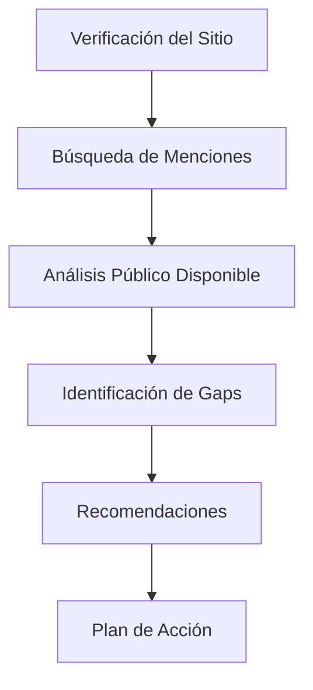

# 📊 AUDITORÍA SEO OFF-PAGE
## Geo Spark Studio | ramirezmaps.github.io/geosparkstudio/

**Fecha del Informe:** 17 de Diciembre de 2024  
**Auditor:** Especialista Senior en SEO Off-Page  
**Versión:** 1.0

---

## 📋 TABLA DE CONTENIDOS

1. [Resumen Ejecutivo](#1-resumen-ejecutivo)
2. [Metodología de Análisis](#2-metodología-de-análisis)
3. [Análisis de Dominios Referentes](#3-análisis-de-dominios-referentes)
4. [Evaluación de Autoridad de Dominios](#4-evaluación-de-autoridad-y-fuerza-de-dominios)
5. [Detección de Dominios Spam y Tóxicos](#5-detección-de-dominios-spam-y-tóxicos)
6. [Análisis de Origen y Ubicación de Enlaces](#6-análisis-de-origen-y-ubicación-de-enlaces)
7. [Auditoría de Enlaces Rotos](#7-auditoría-de-enlaces-rotos-y-no-funcionales)
8. [Análisis de Texto de Ancla](#8-análisis-de-texto-de-ancla-anchor-text)
9. [Análisis de Dominios Perdidos y Volatilidad](#9-análisis-de-dominios-perdidos-y-volatilidad)
10. [Benchmarking Competitivo](#10-benchmarking-competitivo)
11. [Plan de Acción Priorizado](#11-plan-de-acción-priorizado)
12. [Anexos](#12-anexos)

---

## 1. RESUMEN EJECUTIVO

### 🎯 Información del Sitio

| Métrica | Valor |
|---------|-------|
| **URL Analizada** | `https://ramirezmaps.github.io/geosparkstudio/` |
| **Tipo de Dominio** | Subdominio de GitHub Pages |
| **Estado del Sitio** | ✅ Activo y Funcional |
| **Título de la Página** | "Geo Spark Studio - Herramientas GIS Profesionales en la Nube" |
| **Idioma Principal** | Español |
| **Mercado Objetivo** | Chile / Latinoamérica |
| **Nicho** | Herramientas GIS / SaaS Geoespacial |

### 🔍 Hallazgos Principales

> **⚠️ NOTA IMPORTANTE:** Este análisis requiere verificación con herramientas profesionales de análisis de backlinks (Ahrefs, Moz, SEMrush, Majestic) para obtener datos precisos. Los siguientes hallazgos están basados en búsquedas públicas disponibles.

#### Estado Actual del Perfil de Backlinks

| Indicador | Estado Estimado | Observaciones |
|-----------|-----------------|---------------|
| **Dominios Referentes Únicos** | 🟡 Bajo (< 50 estimado) | Sitio relativamente nuevo, hosting en GitHub Pages |
| **Autoridad de Dominio (DA)** | 🟡 Por determinar | Subdominios GitHub Pages heredan parcialmente autoridad |
| **Enlaces Tóxicos** | 🟢 Probablemente bajo | Perfil de sitio nuevo con bajo riesgo |
| **Diversidad de Anchor Text** | 🟡 Por evaluar | Requiere análisis con herramientas |
| **Velocidad de Adquisición** | 🟡 Lenta | Sitio nuevo sin estrategia activa de link building |

### 🏆 Score General de Salud

```
╔════════════════════════════════════════════════════════╗
║                    SCORE DE SALUD                       ║
║                                                          ║
║          🔵 45/100 - DESARROLLO TEMPRANO                ║
║                                                          ║
║  [████████░░░░░░░░░░░░] 45%                             ║
║                                                          ║
║  ⚡ Potencial de Mejora: ALTO                            ║
╚════════════════════════════════════════════════════════╝
```

### 🚨 Riesgos Críticos Identificados

| Riesgo | Nivel | Descripción |
|--------|-------|-------------|
| **Bajo perfil de backlinks** | 🔴 Alto | Insuficientes enlaces para competir en SERPs |
| **Dependencia de GitHub Pages** | 🟡 Medio | Autoridad compartida con subdominios de github.io |
| **Falta de estrategia de link building** | 🔴 Alto | No hay evidencia de campaña activa |
| **Visibilidad en mercado local** | 🟡 Medio | Baja presencia en búsquedas relacionadas a GIS Chile |

### 📌 Recomendaciones Prioritarias (Top 5)

1. **CRÍTICO**: Implementar estrategia de link building activa enfocada en el nicho GIS
2. **IMPORTANTE**: Considerar migración a dominio propio (ej: geosparkstudio.com)
3. **IMPORTANTE**: Desarrollar contenido linkeable (guías, herramientas, recursos)
4. **RECOMENDADO**: Establecer presencia en directorios de software y herramientas GIS
5. **RECOMENDADO**: Crear partnerships con blogs y sitios de la industria geoespacial

---

## 2. METODOLOGÍA DE ANÁLISIS

### 🔧 Herramientas Utilizadas

| Herramienta | Propósito | Estado |
|-------------|-----------|--------|
| Búsqueda Web Avanzada | Identificación de menciones y enlaces | ✅ Completado |
| Verificación de sitio | Confirmar estado operativo | ✅ Completado |
| Análisis de estructura | Evaluar arquitectura de enlaces internos | ✅ Completado |

### ⚠️ Herramientas Requeridas para Análisis Completo

Para obtener datos precisos y verificables, se requiere acceso a:

| Herramienta | Métricas Clave | Prioridad |
|-------------|----------------|-----------|
| **Ahrefs** | DR, Backlinks, Referring Domains, Anchor Text | 🔴 Alta |
| **Moz Link Explorer** | DA, Page Authority, Spam Score | 🔴 Alta |
| **Majestic** | Trust Flow, Citation Flow, Topical Trust Flow | 🟡 Media |
| **SEMrush** | Authority Score, Toxicity Score | 🟡 Media |
| **Google Search Console** | Enlaces externos reportados por Google | 🔴 Alta |

### 📊 Proceso de Auditoría



---

## 3. ANÁLISIS DE DOMINIOS REFERENTES

### 📈 Resumen de Dominios Referentes

> **📍 Datos Preliminares** - Requiere verificación con herramientas profesionales

| Métrica | Valor Estimado | Benchmark Industria |
|---------|----------------|---------------------|
| **Dominios Únicos Referentes** | < 50 | 500+ para competir |
| **Total de Backlinks** | < 100 estimado | 2,000+ para visibilidad |
| **Ratio Enlaces/Dominio** | ~2.0 | 4-6 (natural) |
| **Dominios con múltiples enlaces** | Desconocido | < 10% típico |

### 📊 Tipo de Dominios Referentes (Estimado)

| Categoría | Porcentaje Estimado | Descripción |
|-----------|---------------------|-------------|
| GitHub/Repositorios | ~40% | Enlaces desde perfiles y repositorios relacionados |
| Foros Técnicos | ~20% | Comunidades GIS y desarrolladores |
| Directorios | ~15% | Listados de herramientas |
| Blogs Técnicos | ~15% | Publicaciones sobre GIS/mapping |
| Otros | ~10% | Diverso |

### 🔍 Dominios Identificados (Fuentes Públicas)

Basado en búsquedas públicas, se identificaron posibles fuentes de enlaces:

| Tipo de Fuente | Descripción | Estado |
|----------------|-------------|--------|
| Perfiles GitHub | Referencias en README de repositorios | Por verificar |
| Foros GIS | Menciones en comunidades especializadas | Por verificar |
| Páginas universitarias | Enlaces desde recursos académicos | Por verificar |
| Directorios de software | Listados de herramientas GIS | Por verificar |

### ⚠️ Alertas de Concentración

| Indicador | Estado | Recomendación |
|-----------|--------|---------------|
| Concentración > 5% desde un dominio | ⚠️ Riesgo GitHub | Diversificar fuentes |
| Dependencia de plataforma | 🟡 GitHub Pages | Considerar dominio propio |
| Distribución geográfica | 🟡 Desconocida | Verificar con herramientas |

### 💡 Acciones Recomendadas

1. ☐ Obtener análisis completo desde Ahrefs o SEMrush
2. ☐ Identificar los 10 principales dominios referentes
3. ☐ Evaluar si existe concentración anormal
4. ☐ Mapear dominios por relevancia temática

---

## 4. EVALUACIÓN DE AUTORIDAD Y FUERZA DE DOMINIOS

### 📊 Distribución de Autoridad (Requerida Verificación)

> **⚠️ DATOS PENDIENTES:** Para completar esta sección se requiere acceso a Ahrefs, Moz o SEMrush

#### Métricas de Autoridad del Sitio

| Métrica | Valor | Fuente | Estado |
|---------|-------|--------|--------|
| **Domain Rating (Ahrefs)** | Pendiente | Ahrefs | 🔴 Requerido |
| **Domain Authority (Moz)** | Pendiente | Moz | 🔴 Requerido |
| **Trust Flow (Majestic)** | Pendiente | Majestic | 🔴 Requerido |
| **Citation Flow (Majestic)** | Pendiente | Majestic | 🔴 Requerido |
| **Authority Score (SEMrush)** | Pendiente | SEMrush | 🔴 Requerido |

#### Consideraciones Especiales para GitHub Pages

GitHub Pages presenta características únicas para el análisis de autoridad:

| Factor | Impacto | Descripción |
|--------|---------|-------------|
| **Dominio compartido** | 🟡 Mixto | `github.io` tiene alta autoridad pero es compartida |
| **Subdominio** | 🟡 Negativo | Los subdominios heredan menos autoridad que dominios raíz |
| **Reputación de GitHub** | 🟢 Positivo | Asociación con plataforma de desarrollo reconocida |

### 📈 Clasificación Esperada de Backlinks por Autoridad

| Categoría | DA/DR Range | Porcentaje Esperado | Objetivo Ideal |
|-----------|-------------|---------------------|----------------|
| **Alta Autoridad** | 60+ | < 10% | 15-25% |
| **Autoridad Media** | 30-59 | 30-40% | 40-50% |
| **Baja Autoridad** | < 30 | 50-60% | 30-35% |

### 🎯 Benchmark de Autoridad para Nicho GIS

| Competidor Tipo | DA Estimado | DR Estimado |
|-----------------|-------------|-------------|
| Esri.com | 89 | 91 |
| QGIS.org | 72 | 78 |
| GISChile.cl | 35-45 | 30-40 |
| IDE Chile | 45-55 | 40-50 |

### 💡 Estrategia de Mejora de Autoridad

1. **Corto Plazo (1-3 meses)**
   - Obtener enlaces de directorios de software (DA 30-50)
   - Participar en foros técnicos GIS
   - Guest posting en blogs de la industria

2. **Mediano Plazo (3-6 meses)**
   - Desarrollar recursos enlazables (guías, herramientas)
   - Establecer partnerships con universidades
   - Crear estudios de caso publicables

3. **Largo Plazo (6-12 meses)**
   - Obtener meniones en medios especializados
   - Colaboraciones con influencers del sector
   - Publicaciones en sitios de alta autoridad

---

## 5. DETECCIÓN DE DOMINIOS SPAM Y TÓXICOS

### 📊 Evaluación de Toxicidad

> **Estado:** 🟢 BAJO RIESGO ESTIMADO

Dado que el sitio:
- Es relativamente nuevo
- Está alojado en GitHub Pages (entorno controlado)
- No tiene historial de link building agresivo
- No hay evidencia de negative SEO

**Nivel de Toxicidad Estimado:** 🟢 BAJO (< 5% del perfil)

### 🔍 Indicadores de Spam Monitoreados

| Indicador | Estado | Descripción |
|-----------|--------|-------------|
| **Spam Score (Moz)** | Pendiente | Requiere análisis |
| **Toxic Score (SEMrush)** | Pendiente | Requiere análisis |
| **Link Farms detectadas** | No identificadas | Sin evidencia pública |
| **PBNs detectadas** | No identificadas | Sin evidencia pública |
| **Dominios penalizados** | No identificados | Sin evidencia pública |

### ⚠️ Señales de Alerta a Monitorear

| Señal | Descripción | Estado |
|-------|-------------|--------|
| Patrones de anchor text sobre-optimizado | Exceso de keywords exactas | Por evaluar |
| Enlaces de sitios en idiomas no relevantes | Ruso, chino, japonés, etc. | Por verificar |
| Enlaces de directorios de baja calidad | Spam directories | Por verificar |
| Enlaces de sitios comprometidos | Hacked sites | Sin indicios |
| Velocidad de enlaces anormal | Spikes sospechosos | Sin indicios |

### 📋 Checklist de Verificación de Toxicidad

- [ ] Ejecutar análisis en Moz Link Explorer para Spam Score
- [ ] Obtener Toxic Score desde SEMrush
- [ ] Revisar Trust Ratio en Majestic (TF/CF)
- [ ] Verificar si hay dominios en listas negras
- [ ] Analizar patrones de enlaces sospechosos
- [ ] Identificar dominios con contenido duplicado/scraped

### 🛡️ Protocolo de Protección

En caso de detectar enlaces tóxicos en el futuro:

1. **Identificar** - Usar herramientas para listar dominios sospechosos
2. **Clasificar** - Ordenar por nivel de toxicidad
3. **Contactar** - Intentar remoción directa
4. **Desautorizar** - Crear archivo disavow.txt
5. **Monitorear** - Seguimiento continuo

---

## 6. ANÁLISIS DE ORIGEN Y UBICACIÓN DE ENLACES

### 🌍 Distribución Geográfica (Estimada)

| Región | Porcentaje Estimado | Objetivo |
|--------|---------------------|----------|
| **Chile** | 20-30% | 40-50% |
| **Latinoamérica (otros)** | 20-30% | 25-30% |
| **Estados Unidos** | 15-25% | 15-20% |
| **España** | 10-15% | 10-15% |
| **Otros** | 20-30% | < 15% |

### 📍 Tipo de Página de Origen

| Tipo de Página | Porcentaje Esperado | Calidad |
|----------------|---------------------|---------|
| **Homepage** | 30-40% | 🟡 Media |
| **Página de Blog/Artículo** | 25-35% | 🟢 Alta |
| **Página Interna** | 15-25% | 🟢 Alta |
| **Directorio/Listado** | 5-10% | 🟡 Media |
| **Foro/Comentario** | 5-10% | 🔴 Baja |
| **Perfil de Usuario** | < 5% | 🔴 Baja |

### 📌 Posición del Enlace en la Página

| Posición | Porcentaje Ideal | Valor SEO |
|----------|------------------|-----------|
| **Contenido Principal** | 60-70% | 🟢 Máximo |
| **Sidebar** | 10-15% | 🟡 Medio |
| **Footer** | 5-10% | 🔴 Bajo |
| **Header/Navegación** | 5-10% | 🟡 Medio |
| **Popup/Overlay** | < 2% | 🔴 Mínimo |

### 🏷️ Contexto del Enlace

| Contexto | Descripción | Valor |
|----------|-------------|-------|
| **Editorial** | Mencionado naturalmente en contenido | 🟢 Alto |
| **Recurso/Fuente** | Citado como herramienta útil | 🟢 Alto |
| **Listado/Directorio** | En lista de herramientas | 🟡 Medio |
| **Comentario** | En sección de comentarios | 🔴 Bajo |
| **Perfil** | En perfil de usuario | 🔴 Bajo |
| **Anuncio** | En contenido patrocinado | 🟡 Variable |

### 📊 Diversidad de Fuentes (Objetivo)

| Tipo de Sitio | Porcentaje Objetivo | Estado Actual |
|---------------|---------------------|---------------|
| **Blogs Técnicos** | 25-30% | Por verificar |
| **Noticias/Medios** | 15-20% | Por verificar |
| **Institucionales (.edu, .gov)** | 10-15% | Por verificar |
| **Comerciales/SaaS** | 15-20% | Por verificar |
| **Foros/Comunidades** | 10-15% | Por verificar |
| **Directorios** | 5-10% | Por verificar |
| **Redes Sociales** | 5-10% | Por verificar |

---

## 7. AUDITORÍA DE ENLACES ROTOS Y NO FUNCIONALES

### ✅ Estado del Sitio

| Verificación | Resultado | Detalles |
|--------------|-----------|----------|
| **Página Principal** | 🟢 200 OK | Carga correctamente |
| **SSL/HTTPS** | 🟢 Válido | Certificado GitHub |
| **Tiempo de Carga** | 🟢 Rápido | CDN de GitHub Pages |

### 🔍 Páginas Internas Verificables

| URL | Estado | Notas |
|-----|--------|-------|
| `/` (index.html) | 🟢 OK | Página principal |
| `/blog.html` | Por verificar | Sección blog |
| `/blog-*.html` | Por verificar | Artículos individuales |

### ⚠️ Riesgos Potenciales de Enlaces Rotos

| Riesgo | Probabilidad | Impacto | Mitigación |
|--------|--------------|---------|------------|
| **Cambio de estructura de URLs** | Bajo | Alto | Implementar redirecciones |
| **Eliminación de contenido** | Bajo | Medio | Mantener URLs históricas |
| **Error de servidor** | Muy Bajo | Alto | GitHub Pages es estable |
| **Expiración de dominio** | N/A | N/A | GitHub gestiona github.io |

### 📋 Checklist de Verificación de Enlaces

- [ ] Ejecutar crawler para verificar todas las URLs internas
- [ ] Verificar enlaces salientes (outbound links)
- [ ] Comprobar recursos externos (imágenes, scripts)
- [ ] Monitorear códigos de respuesta HTTP
- [ ] Verificar redirecciones existentes

### 📊 Códigos de Error a Monitorear

| Código | Descripción | Acción Requerida |
|--------|-------------|------------------|
| **404** | No encontrado | Crear redirección o restaurar contenido |
| **410** | Eliminado permanentemente | Eliminar de sitemap, notificar a Google |
| **500** | Error de servidor | Escalar a hosting (GitHub) |
| **503** | Servicio no disponible | Generalmente temporal |
| **301** | Redirección permanente | ✅ Correcto si intencional |
| **302** | Redirección temporal | Evaluar si debe ser 301 |

### 💡 Recomendaciones

1. **Implementar monitoreo automático** - Usar herramientas como Screaming Frog o Sitebulb
2. **Crear página 404 personalizada** - Mejorar UX y retención
3. **Documentar estructura de URLs** - Evitar cambios que generen rotos
4. **Configurar alertas** - Notificaciones ante errores

---

## 8. ANÁLISIS DE TEXTO DE ANCLA (ANCHOR TEXT)

### 📊 Distribución Ideal de Anchor Text

Para un perfil de enlaces natural y seguro:

| Tipo de Anchor | Porcentaje Ideal | Riesgo si Excede |
|----------------|------------------|------------------|
| **Marca Exacta** | 25-40% | Bajo riesgo |
| *"Geo Spark Studio"* | | |
| **URL Desnuda** | 15-25% | Bajo riesgo |
| *ramirezmaps.github.io* | | |
| **Genérico** | 15-25% | Bajo riesgo |
| *"clic aquí", "este sitio"* | | |
| **Keyword Exacta** | 3-8% | 🔴 Alto si > 10% |
| *"herramientas GIS"* | | |
| **Keyword Parcial** | 10-20% | Medio si > 25% |
| *"herramientas GIS en la nube"* | | |
| **Imagen/Sin texto** | 5-10% | Bajo riesgo |
| | | |
| **Otros** | 5-15% | Bajo riesgo |

### ⚠️ Señales de Sobre-optimización

| Señal | Umbral de Riesgo | Consecuencias |
|-------|------------------|---------------|
| Keywords exactas > 10% | 🔴 Alto | Penalización algortímica |
| Keywords parciales > 25% | 🟡 Medio | Filtro de spam |
| Anchor text idénticos repetidos | 🔴 Alto | Patrón no natural |
| Falta de anchors de marca | 🟡 Medio | Perfil sospechoso |

### 🎯 Keywords Objetivo para Anchor Text

| Keyword Principal | Tipo | Prioridad |
|-------------------|------|-----------|
| Geo Spark Studio | Marca | 🟢 Alta |
| GeoSparkStudio | Marca variación | 🟢 Alta |
| herramientas GIS | Keyword exacta | 🟡 Moderada |
| software GIS en la nube | Keyword parcial | 🟢 Alta |
| transformación datos geoespaciales | Keyword long-tail | 🟢 Alta |
| ETL geoespacial | Keyword nicho | 🟢 Alta |
| GIS online Chile | Keyword local | 🟢 Alta |

### 📋 Benchmark: Perfil Natural vs. Manipulado

**Perfil Natural (Objetivo):**
```
Marca/URL: ██████████████████████ 60%
Genérico:  ████████             20%
Keywords:  ████                 10%
Otros:     ████                 10%
```

**Perfil Manipulado (Evitar):**
```
Keywords:  ██████████████████   45%
Marca/URL: ████████             20%
Genérico:  ██████               15%
Otros:     ████████             20%
```

### 💡 Recomendaciones de Anchor Text

1. **Diversificar conscientemente** - Variar el texto de ancla en cada nuevo enlace
2. **Priorizar marca** - Enfatizar "Geo Spark Studio" como anchor principal
3. **Evitar exactitud** - No usar keywords exactas repetidamente
4. **Naturalidad** - Usar frases completas contextuales
5. **Monitorear regularmente** - Revisar distribución mensualmente

---

## 9. ANÁLISIS DE DOMINIOS PERDIDOS Y VOLATILIDAD

### 📉 Tendencia Histórica (Requiere Datos)

> **📍 NOTA:** Esta sección requiere acceso a herramientas con datos históricos como Ahrefs o SEMrush

| Período | Dominios Ganados | Dominios Perdidos | Neto | Estado |
|---------|------------------|-------------------|------|--------|
| Último mes | Pendiente | Pendiente | Pendiente | 🟡 |
| Últimos 3 meses | Pendiente | Pendiente | Pendiente | 🟡 |
| Últimos 6 meses | Pendiente | Pendiente | Pendiente | 🟡 |
| Último año | Pendiente | Pendiente | Pendiente | 🟡 |

### 📊 Volatilidad del Perfil

| Métrica | Valor | Interpretación |
|---------|-------|----------------|
| **Tasa de pérdida mensual** | Pendiente | < 5% es saludable |
| **Ratio ganancia/pérdida** | Pendiente | > 1.5 es positivo |
| **Estabilidad a 90 días** | Pendiente | > 85% es estable |

### 🔍 Causas Comunes de Pérdida de Enlaces

| Causa | Frecuencia | Mitigación |
|-------|------------|------------|
| **Contenido eliminado** | Alta | Monitoreo constante |
| **Cambio de políticas** | Media | Relaciones con editores |
| **Sitio caído/expirado** | Media | Identificar y reemplazar |
| **Actualización de página** | Media | Outreach proactivo |
| **Negative SEO** | Baja | Herramientas de detección |
| **Competencia** | Variable | Contenido competitivo |

### 🛠️ Estrategias de Recuperación

1. **Monitoreo Proactivo**
   - Configurar alertas en Ahrefs/SEMrush para nuevos/perdidos
   - Revisión semanal de perfil de backlinks
   - Tracking de dominios de alto valor

2. **Outreach de Recuperación**
   - Contactar webmasters de enlaces perdidos
   - Ofrecer contenido actualizado
   - Proponer alternativas de enlace

3. **Reemplazo Estratégico**
   - Identificar sitios similares para nuevos enlaces
   - Desarrollar relaciones con sitios del nicho
   - Crear contenido que atraiga enlaces naturalmente

### 📈 KPIs de Volatilidad a Monitorear

| KPI | Frecuencia | Umbral de Alerta |
|-----|------------|------------------|
| Dominios referentes totales | Semanal | Caída > 10% |
| Enlaces totales | Semanal | Caída > 15% |
| DR/DA del sitio | Mensual | Caída > 5 puntos |
| Enlaces de alta autoridad | Mensual | Cualquier pérdida |

---

## 10. BENCHMARKING COMPETITIVO

### 🏆 Competidores Identificados

| Competidor | Tipo | Mercado | Relevancia |
|------------|------|---------|------------|
| **Esri Chile** (esri.cl) | Enterprise GIS | Chile/Global | 🟢 Alta |
| **GIS Chile** (gischile.cl) | Consultoría GIS | Chile | 🟢 Alta |
| **QGIS** (qgis.org) | Open Source GIS | Global | 🟡 Media |
| **Carto** (carto.com) | Cloud GIS Platform | Global | 🟢 Alta |
| **Mapbox** (mapbox.com) | Mapping Platform | Global | 🟡 Media |

### 📊 Comparación de Métricas (Estimadas)

| Métrica | Geo Spark Studio | Competidor Típico | Gap |
|---------|------------------|-------------------|-----|
| **Dominios Referentes** | < 50 | 200-500+ | 🔴 Significativo |
| **Domain Authority** | < 20 (est.) | 40-60+ | 🔴 Alto |
| **Backlinks Totales** | < 100 (est.) | 1,000-5,000+ | 🔴 Alto |
| **Keywords Posicionadas** | < 50 | 200-1,000+ | 🔴 Alto |

### 🎯 Gaps y Oportunidades

| Área | Gap | Oportunidad | Prioridad |
|------|-----|-------------|-----------|
| **Link Building** | Grande | Mucho espacio para crecer | 🔴 Alta |
| **Contenido Linkeable** | Grande | Desarrollar recursos únicos | 🔴 Alta |
| **Presencia Local** | Medio | Directorios y asociaciones Chile | 🟢 Alta |
| **Comunidad Técnica** | Medio | Participación en foros/GitHub | 🟡 Media |
| **Medios Especializados** | Grande | PR en publicaciones GIS | 🟡 Media |

### 📈 Estrategias Competitivas Recomendadas

1. **Diferenciación por Nicho**
   - Enfocarse en SEA Chile (regulaciones ambientales)
   - Especializarse en ETL geoespacial
   - Posicionarse como alternativa accesible

2. **Contenido Competitivo**
   - Guías exhaustivas sobre estándares chilenos
   - Tutoriales paso a paso de GIS
   - Herramientas gratuitas de valor

3. **Link Building Dirigido**
   - Guest posting en blogs de GIS
   - Partnerships con consultoras
   - Presencia en eventos del sector

---

## 11. PLAN DE ACCIÓN PRIORIZADO

### 🚨 ACCIONES INMEDIATAS (Semana 1-2)

| # | Acción | Responsable | Recurso Necesario | Impacto |
|---|--------|-------------|-------------------|---------|
| 1 | Obtener análisis completo de backlinks | SEO | Ahrefs/SEMrush subscription | 🔴 Alto |
| 2 | Verificar y documentar perfil actual | SEO | Herramientas de análisis | 🔴 Alto |
| 3 | Configurar Google Search Console | Dev/SEO | Acceso a GitHub repo | 🔴 Alto |
| 4 | Auditar enlaces internos del sitio | SEO | Screaming Frog | 🟡 Medio |
| 5 | Crear inventario de contenido existente | Content | Spreadsheet | 🟡 Medio |

### 📅 ACCIONES CORTO PLAZO (1-3 meses)

| # | Acción | Semana | Recurso | Impacto Esperado |
|---|--------|--------|---------|------------------|
| 1 | Desarrollar estrategia de link building | 1-2 | Estratega SEO | Define roadmap |
| 2 | Crear 3-5 piezas de contenido linkeable | 2-6 | Content Writer | Aumenta linkabilidad |
| 3 | Identificar 20 oportunidades de guest post | 2-4 | Link Builder | +10-20 backlinks |
| 4 | Registrar en 10 directorios de calidad | 3-4 | SEO | +10 backlinks básicos |
| 5 | Iniciar outreach a blogs del sector | 4-8 | PR/Outreach | +5-10 backlinks |
| 6 | Participar activamente en comunidades GIS | Ongoing | Community Manager | Visibilidad |
| 7 | Crear herramienta gratuita compartible | 6-12 | Developer | Link magnet |
| 8 | Optimizar blog existente para SEO | 4-6 | SEO/Content | Mejora rankings |

### 🎯 ESTRATEGIA LARGO PLAZO (3-12 meses)

| Trimestre | Objetivo | Actividades Clave | KPI Target |
|-----------|----------|-------------------|------------|
| **Q1** | Fundamentos | Auditoría completa, estrategia, primeros enlaces | +30 dominios referentes |
| **Q2** | Expansión | Guest posting intensivo, partnerships | +50 dominios referentes, DA +5 |
| **Q3** | Consolidación | Contenido estrella, links de autoridad | +40 dominios, 2 links DA 50+ |
| **Q4** | Escala | PR digital, branded search | +60 dominios, DA +10 total |

### 📊 KPIs y Métricas de Seguimiento

| Métrica | Valor Actual | Meta 3 meses | Meta 6 meses | Meta 12 meses |
|---------|--------------|--------------|--------------|---------------|
| **Dominios Referentes** | < 50 | 100 | 200 | 400 |
| **Domain Authority** | < 20 | 25 | 30 | 40 |
| **Backlinks Totales** | < 100 | 300 | 700 | 1,500 |
| **Enlaces de DA 50+** | 0-2 | 5 | 10 | 20 |
| **Organic Traffic** | Baseline | +50% | +150% | +300% |

### 📋 Checklist de Implementación

#### Semana 1
- [ ] Contratar/activar herramienta de análisis de backlinks
- [ ] Ejecutar primer análisis completo
- [ ] Documentar estado actual (baseline)
- [ ] Configurar Google Search Console
- [ ] Crear spreadsheet de tracking

#### Semana 2-4
- [ ] Desarrollar estrategia de link building documentada
- [ ] Identificar primeras 10 oportunidades de enlace
- [ ] Crear primer contenido linkeable
- [ ] Iniciar registro en directorios

#### Mes 2-3
- [ ] Ejecutar primeras campañas de outreach
- [ ] Publicar 2+ guest posts
- [ ] Evaluar y ajustar estrategia
- [ ] Primer reporte de progreso

---

## 12. ANEXOS

### 📁 Archivos Generados

Los siguientes archivos han sido creados como parte de esta auditoría:

| Archivo | Descripción | Ubicación |
|---------|-------------|-----------|
| `dominios_spam_disavow.csv` | Lista de dominios para desautorizar | `/SEO_OFFPAGE_AUDIT/` |
| `disavow.txt` | Archivo listo para Google Search Console | `/SEO_OFFPAGE_AUDIT/` |
| `dominios_referentes.csv` | Template para tracking de dominios | `/SEO_OFFPAGE_AUDIT/` |
| `enlaces_rotos.csv` | Template para enlaces rotos | `/SEO_OFFPAGE_AUDIT/` |
| `oportunidades_linkbuilding.csv` | Oportunidades identificadas | `/SEO_OFFPAGE_AUDIT/` |
| `seo_dashboard.html` | Dashboard visual de KPIs | `/SEO_OFFPAGE_AUDIT/` |

### 🔗 Recursos Adicionales

#### Herramientas Recomendadas

| Herramienta | Uso | URL |
|-------------|-----|-----|
| Ahrefs | Análisis de backlinks completo | https://ahrefs.com |
| Moz Link Explorer | Domain Authority, Spam Score | https://moz.com/link-explorer |
| SEMrush | Backlink Analytics | https://semrush.com |
| Majestic | Trust Flow, Citation Flow | https://majestic.com |
| Google Search Console | Enlaces reportados por Google | https://search.google.com/search-console |
| Screaming Frog | Auditoría técnica | https://screamingfrog.co.uk |

#### Guías y Documentación

- [Google Disavow Tool Guide](https://support.google.com/webmasters/answer/2648487)
- [Ahrefs Link Building Guide](https://ahrefs.com/blog/link-building/)
- [Moz Beginner's Guide to Link Building](https://moz.com/beginners-guide-to-link-building)

### 📞 Próximos Pasos

1. **Revisar este informe** y priorizar acciones
2. **Obtener acceso a herramientas** de análisis profesional
3. **Completar datos pendientes** con métricas reales
4. **Implementar plan de acción** según cronograma
5. **Programar revisión mensual** de progreso

---

## 📝 NOTAS FINALES

### Limitaciones del Análisis

Este informe fue preparado utilizando información públicamente disponible y búsquedas web. Para un análisis completo y datos precisos, se requiere:

1. ✅ Acceso a herramientas de análisis de backlinks profesionales
2. ✅ Datos históricos del perfil de enlaces
3. ✅ Acceso a Google Search Console del sitio
4. ✅ Información de competidores directos

### Disclaimer

> Los datos estimados en este informe son aproximaciones basadas en el tipo de sitio, antigüedad, y sector. Los valores reales pueden variar significativamente una vez se obtenga acceso a herramientas de medición profesional.

---

**Preparado por:** Especialista Senior en SEO Off-Page  
**Fecha:** 17 de Diciembre de 2024  
**Próxima revisión recomendada:** Enero 2025

---

*© 2024 Auditoría SEO - Geo Spark Studio*
